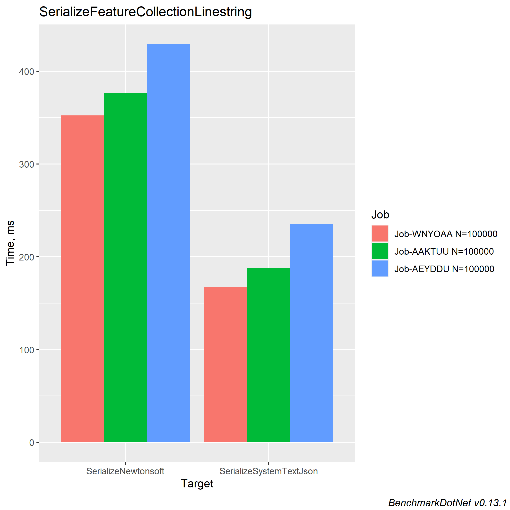
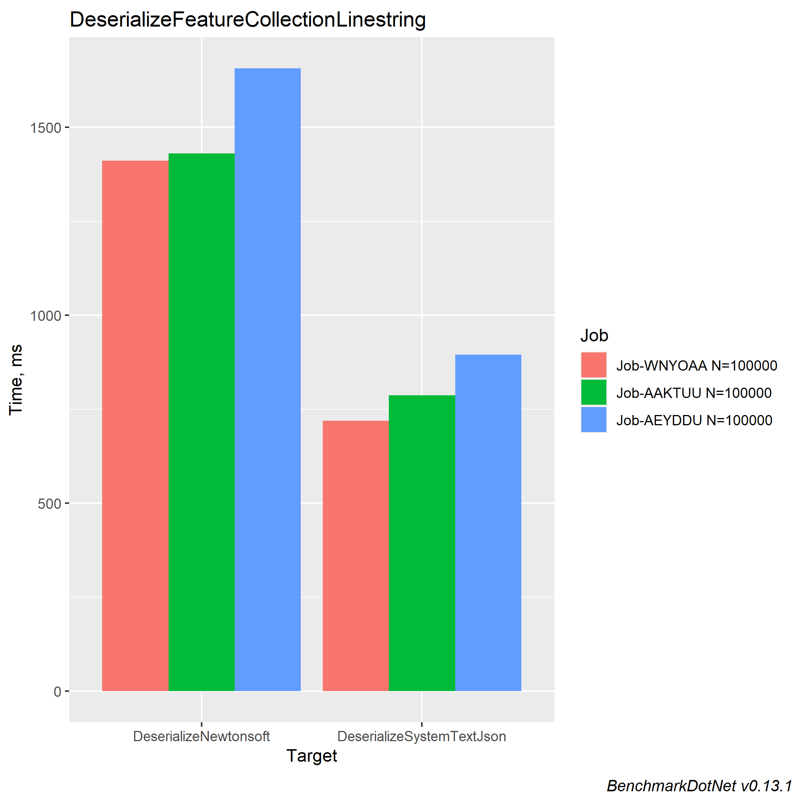

[](https://www.nuget.org/packages/GeoJSON.Text/) [](https://github.com/GeoJSON-Net/GeoJSON.Text/actions/workflows/ci-build.yml) [](https://codecov.io/gh/GeoJSON-Net/GeoJSON.Text)

# GeoJSON.Text
GeoJSON.Text is a .NET library for the [RFC 7946 The GeoJSON Format](https://tools.ietf.org/html/rfc7946) and it uses and provides [System.Text.Json](https://docs.microsoft.com/en-us/dotnet/api/system.text.json?view=net-6.0) converters for serialization and deserialization of GeoJSON data.

## Installation & Usage

[GeoJSON.Text NuGet package](https://www.nuget.org/packages/GeoJSON.Text/):

`Install-Package GeoJSON.Text`

### Serialization

```csharp
Position position = new Position(51.899523, -2.124156);
Point point = new Point(position);

string json = JsonSerializer.Serialize(point);
```

### Deserialization

```csharp
string json = "{\"coordinates\":[-2.124156,51.899523],\"type\":\"Point\"}";

Point point = JsonSerializer.Deserialize<Point>(json);
```

See the [Tests](https://github.com/GeoJSON-Net/GeoJSON.Text/tree/master/src/GeoJSON.Text.Test.Unit) for more examples.

## Special considerations for Newtonsoft.Json

GeoJSON.Text is made to support System.Text.Json, and does not support serializing or deserializing GeoJSON models using Newtonsoft.Json.

If Newtonsoft.Json support is needed, please use [GeoJSON.Net](https://github.com/GeoJSON-Net/GeoJSON.Net).

## GeoJSON.Text vs. GeoJSON.NET

This project uses the System.Text.Json serializers, which has become the default and recommended serializers in .NET Core 3.1+.

Benchmarks shows that serializing and deserializing using System.Text.Json is approximately 100% quicker then Newtonsoft.Json and result in 75% less memory allocation when deserializing and 50% less memory allocation when serializing.

<details>
  <summary>Benchmarks</summary>
  
### Serializing comparison

``` ini

BenchmarkDotNet=v0.13.1, OS=Windows 10.0.19042.1415 (20H2/October2020Update)
Intel Core i7-9850H CPU 2.60GHz, 1 CPU, 12 logical and 6 physical cores
.NET SDK=6.0.100
  [Host]     : .NET 6.0.0 (6.0.21.52210), X64 RyuJIT
  Job-WNYOAA : .NET 6.0.0 (6.0.21.52210), X64 RyuJIT
  Job-AAKTUU : .NET 5.0.13 (5.0.1321.56516), X64 RyuJIT
  Job-AEYDDU : .NET Core 3.1.22 (CoreCLR 4.700.21.56803, CoreFX 4.700.21.57101), X64 RyuJIT

IterationCount=15  LaunchCount=2  WarmupCount=10  

```
|                  Method |        Job |       Runtime |    Toolchain |      N |     Mean |    Error |   StdDev | Ratio | RatioSD | Rank |      Gen 0 |     Gen 1 |    Gen 2 | Allocated |
|------------------------ |----------- |-------------- |------------- |------- |---------:|---------:|---------:|------:|--------:|-----:|-----------:|----------:|---------:|----------:|
| SerializeSystemTextJson | Job-WNYOAA |      .NET 6.0 |        net60 | 100000 | 167.3 ms |  7.28 ms | 10.44 ms |  1.00 |    0.00 |    I |  2000.0000 |         - |        - |     35 MB |
|                         |            |               |              |        |          |          |          |       |         |      |            |           |          |           |
| SerializeSystemTextJson | Job-AAKTUU |      .NET 5.0 |        net50 | 100000 | 188.0 ms |  5.44 ms |  7.80 ms |     ? |       ? |    I |  2000.0000 |         - |        - |     65 MB |
|                         |            |               |              |        |          |          |          |       |         |      |            |           |          |           |
| SerializeSystemTextJson | Job-AEYDDU | .NET Core 3.1 | netcoreapp31 | 100000 | 235.6 ms |  7.85 ms | 11.26 ms |     ? |       ? |    I |  2333.3333 |  333.3333 | 333.3333 |     65 MB |
|                         |            |               |              |        |          |          |          |       |         |      |            |           |          |           |
|     SerializeNewtonsoft | Job-WNYOAA |      .NET 6.0 |        net60 | 100000 | 352.3 ms | 17.33 ms | 24.86 ms |  2.11 |    0.16 |   II | 14000.0000 | 3000.0000 |        - |    112 MB |
|                         |            |               |              |        |          |          |          |       |         |      |            |           |          |           |
|     SerializeNewtonsoft | Job-AAKTUU |      .NET 5.0 |        net50 | 100000 | 376.6 ms | 12.81 ms | 19.17 ms |     ? |       ? |   II | 14000.0000 | 3000.0000 |        - |    112 MB |
|                         |            |               |              |        |          |          |          |       |         |      |            |           |          |           |
|     SerializeNewtonsoft | Job-AEYDDU | .NET Core 3.1 | netcoreapp31 | 100000 | 429.6 ms |  7.57 ms | 10.61 ms |     ? |       ? |   II | 14000.0000 | 3000.0000 |        - |    112 MB |


<p align="center">
  
</p>

### Deserializing comparison

``` ini

BenchmarkDotNet=v0.13.1, OS=Windows 10.0.19042.1415 (20H2/October2020Update)
Intel Core i7-9850H CPU 2.60GHz, 1 CPU, 12 logical and 6 physical cores
.NET SDK=6.0.100
  [Host]     : .NET 6.0.0 (6.0.21.52210), X64 RyuJIT
  Job-WNYOAA : .NET 6.0.0 (6.0.21.52210), X64 RyuJIT
  Job-AAKTUU : .NET 5.0.13 (5.0.1321.56516), X64 RyuJIT
  Job-AEYDDU : .NET Core 3.1.22 (CoreCLR 4.700.21.56803, CoreFX 4.700.21.57101), X64 RyuJIT

IterationCount=15  LaunchCount=2  WarmupCount=10  

```
|                    Method |        Job |       Runtime |    Toolchain |      N |       Mean |    Error |   StdDev | Ratio | RatioSD | Rank |       Gen 0 |      Gen 1 |     Gen 2 | Allocated |
|-------------------------- |----------- |-------------- |------------- |------- |-----------:|---------:|---------:|------:|--------:|-----:|------------:|-----------:|----------:|----------:|
| DeserializeSystemTextJson | Job-WNYOAA |      .NET 6.0 |        net60 | 100000 |   719.6 ms | 38.29 ms | 57.31 ms |  1.00 |    0.00 |    I |  32000.0000 | 12000.0000 | 1000.0000 |    201 MB |
|                           |            |               |              |        |            |          |          |       |         |      |             |            |           |           |
| DeserializeSystemTextJson | Job-AAKTUU |      .NET 5.0 |        net50 | 100000 |   787.3 ms | 22.38 ms | 32.80 ms |     ? |       ? |    I |  32000.0000 | 12000.0000 | 1000.0000 |    201 MB |
|                           |            |               |              |        |            |          |          |       |         |      |             |            |           |           |
| DeserializeSystemTextJson | Job-AEYDDU | .NET Core 3.1 | netcoreapp31 | 100000 |   894.6 ms | 25.84 ms | 37.87 ms |     ? |       ? |    I |  32000.0000 | 12000.0000 | 1000.0000 |    200 MB |
|                           |            |               |              |        |            |          |          |       |         |      |             |            |           |           |
|     DeserializeNewtonsoft | Job-WNYOAA |      .NET 6.0 |        net60 | 100000 | 1,410.8 ms | 27.59 ms | 40.44 ms |  1.96 |    0.13 |   II | 146000.0000 | 37000.0000 | 1000.0000 |    870 MB |
|                           |            |               |              |        |            |          |          |       |         |      |             |            |           |           |
|     DeserializeNewtonsoft | Job-AAKTUU |      .NET 5.0 |        net50 | 100000 | 1,430.7 ms | 31.66 ms | 46.40 ms |     ? |       ? |   II | 146000.0000 | 37000.0000 | 1000.0000 |    870 MB |
|                           |            |               |              |        |            |          |          |       |         |      |             |            |           |           |
|     DeserializeNewtonsoft | Job-AEYDDU | .NET Core 3.1 | netcoreapp31 | 100000 | 1,656.4 ms | 40.05 ms | 58.71 ms |     ? |       ? |   II | 145000.0000 | 37000.0000 | 1000.0000 |    869 MB |


<p align="center">
  
</p>
</details>


## Contributing
Highly welcome! Just fork away and send a pull request. We try and review most pull requests within a couple of days.

## Thanks
This library would be NOTHING without its [contributors](https://github.com/GeoJSON-Net/GeoJSON.Text/graphs/contributors) - thanks so much!!

## Sponsors

 We have the awesome .NET tools from [JetBrains](http://www.jetbrains.com/).

[](http://www.jetbrains.com/resharper/)

## Contributors

This project exists thanks to all the people who contribute. 
<a href="https://github.com/GeoJSON-Net/GeoJSON.Text/graphs/contributors"></a>


## Backers

Thank you to all our backers! 🙏 [[Become a backer](https://opencollective.com/geojson-net#backer)]

<a href="https://opencollective.com/geojson-net#backers" target="_blank"></a>


## Sponsors

Support this project by becoming a sponsor. Your logo will show up here with a link to your website. [[Become a sponsor](https://opencollective.com/geojson-net#sponsor)]

<a href="https://opencollective.com/geojson-net/sponsor/0/website" target="_blank"></a>
<a href="https://opencollective.com/geojson-net/sponsor/1/website" target="_blank"></a>
<a href="https://opencollective.com/geojson-net/sponsor/2/website" target="_blank"></a>
<a href="https://opencollective.com/geojson-net/sponsor/3/website" target="_blank"></a>
<a href="https://opencollective.com/geojson-net/sponsor/4/website" target="_blank"></a>
<a href="https://opencollective.com/geojson-net/sponsor/5/website" target="_blank"></a>
<a href="https://opencollective.com/geojson-net/sponsor/6/website" target="_blank"></a>
<a href="https://opencollective.com/geojson-net/sponsor/7/website" target="_blank"></a>
<a href="https://opencollective.com/geojson-net/sponsor/8/website" target="_blank"></a>
<a href="https://opencollective.com/geojson-net/sponsor/9/website" target="_blank"></a>
